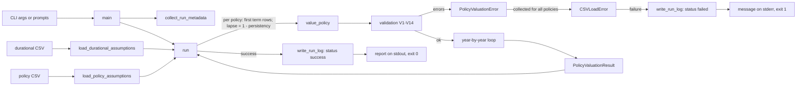

# Term policy death-benefit valuation calculator

## 1. Problem statement

Vita has a working calculator (`modules/pricing-engine/code/policy_valuation.py` and `modules/pricing-engine/code/run_from_csv.py`) that computes the expected present value of a term policy's death benefit, but it was written without a spec. There is no authoritative statement of what it must compute, what inputs it accepts, what it rejects, or what it outputs, so it cannot be rebuilt, reviewed, or tested against a fixed definition. It also leaves no record of what produced a given number.

This spec is the authoritative definition of the calculator. The existing code is the starting point, and Section 5.4 lists every way the required behavior differs from it.

## 2. Background

The pricing engine will eventually combine the outputs of the mortality, persistency, and propensity-to-buy modules into a price and an ROI result. This calculator is the first piece of that combination. It takes a mortality rate per policy year, a persistency rate per policy year, an interest rate per policy year, a propensity-to-buy probability, and a face amount, and returns one number per policy together with a year-by-year schedule.

The calculation has been verified independently. The workbook `modules/pricing-engine/uat/policy_valuation_uat.xlsx` reproduces it with Excel formulas and matches the Python output to full double precision for the two sample policies.

The methodology in Section 6 (Methodology and timing) is approved for this version. An implementing agent must implement exactly what that section states and must not substitute a method it considers more correct.

The output is not a premium, a reserve, or a profit figure.

## 3. Intended users

- The Actuary persona and the human actuary reviewer, who use the calculator, its schedule, and its run log to check that the valuation logic is sound.
- Developers and coding agents working in `modules/pricing-engine/`, who call `value_policy()` and `run()` directly from Python.
- A person running the command-line tool against two CSV files to value a small batch of policies, for example when preparing or checking the Excel verification workbook.

This version has no external or customer-facing users.

## 4. Out of scope

This spec does not cover:

- Premium calculation (net or gross), expense loadings, profit margins, or risk margins.
- Reserves of any kind.
- ROI, IRR, PVFP, or any other profitability metric.
- Selecting or looking up mortality rates from a table (for example the 2015 VBT files in `data/mortality_vbt/`) by age, sex, smoker status, or underwriting class. The calculator receives qx values already chosen for each policy year. See Q4.
- Estimating persistency or propensity. The calculator receives these as inputs.
- Choosing or sourcing the interest rates. See Q5.
- Any timing, decrement, or propensity treatment other than the one in Section 6 (Methodology and timing).
- Premium income, cash values, or any benefit other than the death benefit.
- HTTP APIs, Lambda handlers, Step Functions, MCP tools, or any AWS deployment.
- A Dockerfile. See Section 5.5, R19.
- Any output other than standard output, standard error, and the JSON run log in Section 6 (Run log).
- Test scenarios, test data, golden values, and test procedures. These are defined in the companion testing document (Section 8).

## 5. Requirements

### 5.1 Core valuation function

R1. `code/policy_valuation.py` provides `value_policy(qx, lapse, propensity_to_buy, term, interest_rate=0.0, benefit_amount=1.0)`, which returns a `PolicyValuationResult` (Section 6, Data).

R2. `value_policy` validates all inputs before calculating. It checks every rule in Section 6 (Validation rules for value_policy), collects every violation, and if there is at least one, raises a single `PolicyValuationError` whose message lists all of them. It does not stop at the first violation.

R3. `interest_rate` may be a single number, applied to every policy year, or a sequence with exactly `term` elements, one per policy year.

R4. The calculation follows Section 6 (Calculation) exactly, including the order of floating-point operations.

R5. The result contains the headline value (after propensity), the value before propensity, and a schedule with one entry per policy year from 1 to `term`, in order.

R6. `value_policy` has no side effects. It does not print, log, read or write files, or modify its inputs.

R7. `value_policy` enforces these input limits (Section 6, Input limits): `term` from 1 to 100; each interest rate from 0 to 0.20 inclusive; `benefit_amount` greater than 0 and at most 100,000,000.

### 5.2 CSV loading and batch run

R8. `code/run_from_csv.py` provides `load_durational_assumptions(path)`, which reads and validates the durational CSV (Section 6) and returns a list of `DurationRow` sorted by duration.

R9. `code/run_from_csv.py` provides `load_policy_assumptions(path)`, which reads and validates the policy CSV and returns a list of `PolicyRow` in file order.

R10. Both loaders collect every row-level violation in the file and raise a single `CSVLoadError` listing all of them. A missing required column raises immediately, because no row can be read without it. A file that cannot be read or is not valid UTF-8 also raises immediately.

R11. `code/run_from_csv.py` provides `run(durational_path, policy_path)`, which loads both files, values every policy, and returns a list of `(PolicyRow, PolicyValuationResult)` pairs in file order.

R12. `run` reports all failures together (Section 6, run()). If either file fails to load, it attempts to load the other anyway and raises one `CSVLoadError` containing the errors from both. If both files load, it attempts every policy, and if any policy fails, it raises one `CSVLoadError` listing every failing policy. It never returns a partial result list.

### 5.3 Command-line interface

R13. Running `python code/run_from_csv.py [DURATIONAL_CSV] [POLICY_CSV] [LOG_FOLDER]` from `modules/pricing-engine/` values every policy, writes a JSON run log, and prints the report in Section 6 (CLI behavior).

R14. Each of the three paths is optional on the command line. For each one not given, the CLI prompts the user for it, in the order durational CSV, policy CSV, log folder. An empty answer, or a path that does not exist, causes the same prompt to be shown again. There are no default paths.

R15. Every run that reaches the valuation step writes a JSON run log (Section 6, Run log), whether it succeeds or fails. A run stopped before the valuation step because a command-line path does not exist writes no log.

R16. On failure, the CLI prints the error message to standard error, prints nothing to standard output other than the prompts, and exits with status code 1. It never prints a Python traceback. On success it exits with status code 0.

### 5.4 Changes from the current implementation

The current code is the reference for everything in this spec except the items below. All of them are approved (see Section 9, Decisions).

| ID | Change | Current behavior |
|---|---|---|
| D1 | Every input number must be finite. NaN, +infinity, and -infinity are validation errors, in `value_policy` and in both CSV loaders. | `interest_rate` and `benefit_amount` accept NaN and infinity. An infinite interest rate silently sets later discount factors to 0. The CSV loaders accept `nan` and `inf`. |
| D2 | If `qx` or `lapse` is not a sequence, `value_policy` raises `PolicyValuationError`. | Raises an unhandled `TypeError` from `len()`. |
| D3 | CSV files are read as UTF-8, and a leading UTF-8 byte-order mark is ignored (encoding `utf-8-sig`). A file that is not valid UTF-8 raises `CSVLoadError`. | Uses the platform default encoding. On Windows a CSV saved by Excel as "CSV UTF-8" fails with a missing `duration` column. |
| D4 | CLI errors go to standard error with no traceback, and the exit code is 1. | Unhandled Python traceback. |
| D5 | Input limits: `term` at most 100; interest rates from 0 to 0.20; `benefit_amount` at most 100,000,000. | `term` has no maximum; any interest rate above -1 is accepted, including negatives; `benefit_amount` has no maximum. |
| D6 | `run` values every policy and reports every failure together. Load errors from both files are reported together. | Stops at the first failing policy. Stops at the first file that fails to load. |
| D7 | Every run writes a JSON run log with run metadata, results, or errors. The CLI prints a metadata header and the log path. | No record of a run is kept. |
| D8 | The CLI prompts for any path not given on the command line. | Falls back to `durational_assumptions.csv` and `policy_assumptions.csv` in the current directory. |
| D9 | Validation messages for `term`, `interest_rate`, and `benefit_amount` change to state the new limits (Section 6, Validation rules). | Older messages. |

### 5.5 Repository placement and packaging

R17. The module keeps its current folders (`code/`, `input/`, `uat/`, `specs/`) and adds `contracts/`, `tests/`, and `README.md`, using the layout in Section 6 (File layout).

R18. The implementation uses only the Python standard library at runtime. Test-only dependencies are listed in `requirements-dev.txt` with exact pinned versions.

R19. No Dockerfile is added in this version. This is a known, deliberate exception to the `AGENTS.md` rule that every module has a Dockerfile. It must be resolved by a later deployment spec before this module is deployed.

R20. The JSON Schema contract files in Section 6 (API contract) are created as part of this work.

## 6. Technical design

### Glossary

Each term has exactly one meaning in this spec, in the code, and in the run log.

| Term | Meaning |
|---|---|
| Policy year | The one-year period starting at issue or at a policy anniversary. Policy year 1 starts at issue. |
| Duration | The policy year number. Duration `t` is policy year `t`. Durations start at 1. |
| Period | Used in code and field names to mean one policy year. |
| Term | The number of policy years the policy covers, from 1 to 100. |
| qx | The probability that a life in force at the start of a policy year dies during that year. In code, `qx[t-1]` is the rate for policy year `t`. |
| Lapse rate | The probability that a policy that is in force at the start of a policy year, and whose insured survives that year, lapses at the end of that year. |
| Persistency rate | 1 minus the lapse rate for the same policy year. The durational CSV stores persistency; the calculator uses lapse. |
| In force | A policy is in force at the start of a policy year if the insured has not died and the policy has not lapsed in any earlier year. `in_force_prob` is the probability of this. |
| Interest rate | The annual effective rate used to discount cash flows over one policy year, as a decimal (0.05 means 5%). |
| Discount factor | The present value at issue of 1 paid at the end of policy year `t`. |
| Face amount / benefit amount | The amount paid on death. The CSV column is `face_amount`; the function parameter is `benefit_amount`. They are the same thing. |
| Expected death benefit | The probability-weighted death benefit for one policy year, undiscounted. |
| APV | Actuarial present value: the sum over all policy years of the expected death benefit multiplied by the discount factor. This is `value_before_propensity`. |
| Propensity to buy | The probability, from 0 to 1, that the policy is issued at all. |
| Value | APV multiplied by propensity to buy. The headline output. |
| Schedule | The list of per-year details that make up a valuation. |
| Run | One execution of `run()` through the CLI, on one pair of input files. |
| Run log | The JSON file that records one run (Section 6, Run log). |

### Methodology and timing

These are fixed, approved choices for this version. Each is implemented exactly as stated.

1. **Time unit.** Every period is one policy year. There are no fractional years.
2. **Rate basis.** qx, lapse, persistency, and interest rates are all annual rates for their policy year. No conversion between rate bases is done.
3. **Start of the valuation.** The valuation date is the issue date. The probability of being in force at the start of policy year 1 is exactly 1.
4. **Death timing.** A death during policy year `t` pays the benefit amount at the **end** of policy year `t`, and is discounted for `t` full years.
5. **Lapse timing.** Lapses in policy year `t` occur at the **end** of policy year `t`, after deaths. A policy that lapses in year `t` is exposed to death for the whole of year `t`, and a death in year `t` is paid in full. The lapse rate applies only to policies whose insured survived year `t`.
6. **Decrement independence.** Death and lapse are independent. The probability of remaining in force from the start of year `t` to the start of year `t+1` is `(1 - q_t) * (1 - l_t)`.
7. **Discounting.** The discount factor for year `t` is the product of `1 / (1 + r_k)` for `k = 1..t`, where `r_k` is the annual rate for year `k`. A flat rate is the case where every `r_k` is equal.
8. **Propensity.** Propensity to buy is applied once, as a multiplier on the total APV. It does not affect the survival chain.
9. **No rounding.** No rounding is applied anywhere in the calculation. Rounding happens only in the CLI display. The run log stores full-precision values.

### Input limits

Defined as module-level constants in `code/policy_valuation.py`:

```python
MAX_TERM = 100
MIN_INTEREST_RATE = 0.0
MAX_INTEREST_RATE = 0.20
MAX_BENEFIT_AMOUNT = 100_000_000
```

All limits are inclusive: a term of exactly 100, an interest rate of exactly 0 or exactly 0.20, and a benefit amount of exactly 100,000,000 are valid. There is no limit on the number of policies in a file.

### File layout

All paths are relative to the repository root.

```
modules/pricing-engine/
├── README.md                                 # new
├── requirements-dev.txt                      # new
├── specs/
│   ├── pricing engine module - spec.md       # this spec
│   └── pricing engine module - testing.md    # companion testing document (to be written)
├── code/
│   ├── policy_valuation.py                   # modified
│   ├── run_from_csv.py                       # modified
│   └── run_log.py                            # new
├── input/                                    # unchanged: sample data for running the CLI by hand
│   ├── durational_assumptions.csv
│   └── policy_assumptions.csv
├── uat/                                      # unchanged
│   └── policy_valuation_uat.xlsx
├── contracts/                                # new
│   ├── policy-valuation.input.schema.json
│   ├── policy-valuation.output.schema.json
│   ├── durational-assumptions.csv.schema.json
│   ├── policy-assumptions.csv.schema.json
│   └── valuation-run-log.schema.json
└── tests/                                    # new; contents defined by the testing document
```

Imports between files in `code/` are plain sibling imports (for example `from policy_valuation import value_policy`), because the files run as scripts, not as an installed package. Import dependencies go in one direction only: `run_from_csv.py` imports from `policy_valuation.py` and `run_log.py`; `run_log.py` imports from neither (it serializes results with `dataclasses.asdict`); `policy_valuation.py` imports nothing from the other two.

`README.md` states the module's purpose, its inputs and outputs, the owning persona (actuary), how to run the CLI and the tests, the Dockerfile exception (R19), and a link to this spec.

### Data

#### Exceptions

```yaml
PolicyValuationError:
  base: ValueError
  module: code/policy_valuation.py
  message_format: "Invalid policy valuation inputs:\n- <error 1>\n- <error 2> ..."
CSVLoadError:
  base: ValueError
  module: code/run_from_csv.py
```

#### Data classes

All are standard-library `@dataclass` classes.

```yaml
PeriodDetail:               # policy_valuation.py; one per policy year
  period: int                   # 1..term
  in_force_prob: float          # probability in force at START of this policy year
  qx: float                     # this year's mortality rate, as given
  lapse: float                  # this year's lapse rate, as given
  interest_rate: float          # this year's annual rate
  expected_death_benefit: float # undiscounted, before propensity
  discount_factor: float        # cumulative, years 1..t
  present_value: float          # discounted, before propensity

PolicyValuationResult:      # policy_valuation.py
  value: float                  # headline number, after propensity
  value_before_propensity: float
  schedule: list[PeriodDetail]  # default_factory=list; length == term

DurationRow:                # run_from_csv.py
  duration: int
  qx: float
  persistency_rate: float
  interest_rate: float

PolicyRow:                  # run_from_csv.py
  policy_id: str
  term: int
  propensity_to_buy: float
  face_amount: float

InputFile:                  # run_log.py
  role: str                     # "durational" or "policy"
  path: str                     # the path exactly as the user gave it
  sha256: str | None            # lowercase hex digest of the file's bytes; None if the file could not be read

RunMetadata:                # run_log.py
  run_id: str                   # "valuation-run-" + started_at_utc in the form YYYYMMDDTHHMMSSZ
  started_at_utc: str           # ISO 8601, UTC, whole seconds, e.g. "2026-09-23T14:05:09Z"
  spec_id: str                  # "pricing-engine-policy-valuation"
  spec_version: str             # this spec's version, e.g. "0.2"
  code_commit: str | None       # full 40-character git commit hash; None if git is unavailable
  code_dirty: bool | None       # True if code/ has uncommitted changes; None if git is unavailable
  inputs: list[InputFile]       # durational first, then policy
```

`SPEC_ID` and `SPEC_VERSION` are module-level constants in `code/run_log.py`. `SPEC_VERSION` must equal the `version` in this spec's frontmatter.

#### Definitions used by the validation rules

- A **number** is a value for which `isinstance(x, numbers.Real)` is true and `isinstance(x, bool)` is false. This accepts `int`, `float`, and NumPy numeric scalars, and rejects `True` and `False`.
- A **finite number** is a number for which `math.isfinite(x)` is true (D1).
- A **sequence** is a `list` or `tuple`, or any object that has both `__len__` and `__getitem__` and is not a `str` or `bytes`. This accepts NumPy arrays.

#### Validation rules for value_policy

Rules are checked in the order listed, and messages are appended in that order. `{x!r}` means Python `repr`; `{x}` means Python `str`. Within a per-element rule, elements are checked in index order. For each element or scalar, at most one message is reported: the first that applies, in the order listed under that rule.

```yaml
- id: V1
  check: term is an int, not a bool, and 1 <= term <= MAX_TERM
  message: "term must be an integer from 1 to 100, got {term!r}"
  note: if V1 fails, V4 (length checks) and V11-V13 (sequence interest checks) are skipped
- id: V2
  check: qx is a sequence                                        # D2
  message: "qx must be a sequence of numbers, got {qx!r}"
  note: if V2 fails, V4 for qx, V5, and V8 are skipped
- id: V3
  check: lapse is a sequence                                     # D2
  message: "lapse must be a sequence of numbers, got {lapse!r}"
  note: if V3 fails, V4 for lapse, V6, and V8 are skipped
- id: V4
  check: len(qx) == term, then len(lapse) == term
  messages:
    - "qx has length {len(qx)}, expected {term} (one value per policy year)"
    - "lapse has length {len(lapse)}, expected {term} (one value per policy year)"
- id: V5
  check: each qx[i] is a finite number in [0, 1]
  messages:
    not_number:   "qx[{i}] is not a number: {q!r}"
    not_finite:   "qx[{i}] = {q} is not finite"                   # D1
    out_of_range: "qx[{i}] = {q} is outside [0, 1]"
- id: V6
  check: each lapse[i] is a finite number in [0, 1]
  messages:
    not_number:   "lapse[{i}] is not a number: {l!r}"
    not_finite:   "lapse[{i}] = {l} is not finite"                # D1
    out_of_range: "lapse[{i}] = {l} is outside [0, 1]"
- id: V7
  note: reserved, not used
- id: V8
  check: only when len(qx) == len(lapse); for each i where qx[i] and lapse[i] are both finite numbers, qx[i] + lapse[i] <= 1
  message: "qx[{i}] + lapse[{i}] = {q + l} > 1 — death and lapse probabilities for the same policy year cannot sum past 1"
- id: V9
  check: propensity_to_buy is a finite number in [0, 1]
  messages:
    not_number:   "propensity_to_buy is not a number: {p!r}"
    not_finite:   "propensity_to_buy = {p} is not finite"         # D1
    out_of_range: "propensity_to_buy = {p} is outside [0, 1]"
- id: V10
  check: scalar interest_rate is finite and in [MIN_INTEREST_RATE, MAX_INTEREST_RATE]
  applies_when: interest_rate is a number (checked whether or not V1 passed)
  messages:
    not_finite:   "interest_rate = {r} is not finite"              # D1
    out_of_range: "interest_rate = {r} is outside [0, 0.2] (annual rate as a decimal, e.g. 0.05 for 5%)"   # D5
- id: V11
  check: sequence interest_rate has length == term
  applies_when: V1 passed and interest_rate is a sequence
  message: "interest_rate has length {n}, expected {term} (one rate per policy year) when given as a sequence"
  note: if V11 fails, V12 is skipped
- id: V12
  check: each interest_rate[i] is a finite number in [MIN_INTEREST_RATE, MAX_INTEREST_RATE]
  applies_when: V1 passed, interest_rate is a sequence, V11 passed
  messages:
    not_number:   "interest_rate[{i}] is not a number: {r!r}"
    not_finite:   "interest_rate[{i}] = {r} is not finite"        # D1
    out_of_range: "interest_rate[{i}] = {r} is outside [0, 0.2] (annual rate as a decimal, e.g. 0.05 for 5%)"   # D5
- id: V13
  check: interest_rate is a number or a sequence
  applies_when: V1 passed
  message: "interest_rate must be a number or a sequence of numbers, got {interest_rate!r}"
- id: V14
  check: benefit_amount is a finite number, > 0, and <= MAX_BENEFIT_AMOUNT
  messages:
    not_number: "benefit_amount is not a number: {b!r}"
    not_finite: "benefit_amount = {b} is not finite"              # D1
    too_low:    "benefit_amount = {b} must be positive"
    too_high:   "benefit_amount = {b} exceeds the maximum of 100,000,000"   # D5
```

Boundary values are valid: qx of exactly 0 or 1, lapse of exactly 0 or 1, qx + lapse of exactly 1, propensity of exactly 0 or 1, term of exactly 1 or 100, interest rate of exactly 0 or 0.20, and benefit amount of exactly 100,000,000.

#### Durational assumptions CSV

One row per policy year. Shared by every policy in a run.

```yaml
file: any path; sample at modules/pricing-engine/input/durational_assumptions.csv
encoding: utf-8-sig                          # D3
header_row: required
required_columns: [duration, qx, persistency_rate, interest_rate]
extra_columns: ignored
column_order: any
columns:
  duration:         {parse: int(),   rule: "unique; after sorting, exactly 1..N with no gaps"}
  qx:               {parse: float(), rule: "finite (loader); range checked by value_policy (V5)"}
  persistency_rate: {parse: float(), rule: "finite, in [0, 1], checked by the loader"}
  interest_rate:    {parse: float(), rule: "finite (loader); range checked by value_policy (V12)"}
conversion: "lapse = 1.0 - persistency_rate, computed in run(), not stored"
```

Loader behavior, in order:

1. Open with `newline=""` and encoding `utf-8-sig`, and read with `csv.DictReader`. If the file cannot be opened, raise immediately: `CSVLoadError(f"{path}: file cannot be read: {e}")`, where `e` is the `OSError`. If the file is not valid UTF-8, raise immediately: `CSVLoadError(f"{path}: file is not valid UTF-8 text")`.
2. If any required column is missing from the header, raise immediately: `CSVLoadError(f"{path}: missing required column(s): {sorted(missing)}")`.
3. For each data row, the row label is `f"{path}, row {i}"` where `i` is the 1-based line number in the file with the header as row 1, so the first data row is row 2.
4. Parse `duration` with `int()`. On failure, append `f"{row_label}: duration = {raw!r} is not an integer"` and skip the rest of this row. The string `"3.0"` is not a valid integer.
5. If the duration was already seen, append `f"{row_label}: duplicate duration {duration}"`. Continue processing the row.
6. Parse `qx`, `persistency_rate`, and `interest_rate` with `float()`. For each that fails, append `f"{row_label}: {field} = {raw!r} is not a number"`. For each that parses to a non-finite value, append `f"{row_label}: {field} = {raw!r} is not finite"` (D1) and treat it as a failed parse.
7. If `persistency_rate` parsed and is outside [0, 1], append `f"{row_label}: persistency_rate = {value} is outside [0, 1]"`. The row is still kept.
8. If all three floats parsed, append a `DurationRow` to the result.
9. After all rows, sort the result by duration. If the list of durations is not exactly `[1, 2, ..., len(rows)]`, append `f"{path}: durations must be contiguous starting at 1 with no gaps — found {actual}, expected {expected}"`.
10. If any messages were collected, raise `CSVLoadError("Invalid durational assumptions file:\n- " + "\n- ".join(messages))`.

A file with a header and no data rows is valid and returns an empty list.

#### Policy assumptions CSV

One row per policy to value.

```yaml
file: any path; sample at modules/pricing-engine/input/policy_assumptions.csv
encoding: utf-8-sig                          # D3
header_row: required
required_columns: [policy_id, term, propensity_to_buy, face_amount]
extra_columns: ignored
column_order: any
columns:
  policy_id:         {parse: str as-is, rule: "non-empty; unique within file"}
  term:              {parse: int(),     rule: "> 0 (loader); <= 100 checked by value_policy (V1); <= number of durational rows checked in run()"}
  propensity_to_buy: {parse: float(),   rule: "finite (loader); range checked by value_policy (V9)"}
  face_amount:       {parse: float(),   rule: "finite (loader); passed as benefit_amount; range checked by value_policy (V14)"}
```

Loader behavior, in order:

1. Open and check required columns exactly as for the durational file, including the unreadable-file and not-UTF-8 errors.
2. The row label is `f"{path}, row {i} (policy_id={policy_id!r})"`.
3. If `policy_id` is empty, append `f"{row_label}: policy_id is empty"`. Otherwise, if it was already seen, append `f"{row_label}: duplicate policy_id {policy_id!r}"`.
4. Parse `term` with `int()`. If parsing fails or the result is not greater than 0, append `f"{row_label}: term = {raw!r} is not a positive integer"`.
5. Parse `propensity_to_buy` and `face_amount` with `float()`, using the same not-a-number and not-finite messages as the durational loader.
6. If term, propensity, and face amount all parsed, append a `PolicyRow`. A row with an empty or duplicate policy_id is still appended, but its error causes the load to fail at step 7.
7. If any messages were collected, raise `CSVLoadError("Invalid policy assumptions file:\n- " + "\n- ".join(messages))`.

A file with a header and no data rows is valid and returns an empty list.

#### run()

```
run(durational_path, policy_path) -> list[tuple[PolicyRow, PolicyValuationResult]]
```

1. Call `load_durational_assumptions(durational_path)`, then `load_policy_assumptions(policy_path)`. Call the second even if the first raised `CSVLoadError`. If either raised, raise `CSVLoadError` whose message is the message of each error that occurred, in that order, joined by `"\n"`.
2. Let `N` be the number of durational rows. Create an empty list of policy errors. For each policy in file order:
   1. If `policy.term > N`, append `f"Policy {policy.policy_id!r} has term={policy.term}, but {durational_path} only has {N} duration(s) of assumptions"` and continue to the next policy.
   2. Take the first `policy.term` durational rows. Build `qx` from their `qx`, `lapse` as `1.0 - persistency_rate` for each, and `interest_rate` as a list from their `interest_rate`.
   3. Call `value_policy(qx=qx, lapse=lapse, propensity_to_buy=policy.propensity_to_buy, term=policy.term, interest_rate=interest_rate, benefit_amount=policy.face_amount)`.
   4. If it raises `PolicyValuationError e`, append `f"Policy {policy.policy_id!r} failed valuation: {e}"` and continue to the next policy.
3. If the list of policy errors is not empty, raise `CSVLoadError(f"Valuation failed for {len(errors)} of {len(policies)} policies:\n\n" + "\n\n".join(errors))`.
4. Return the list of pairs.

`run()` does not write the run log, prompt, or print. The CLI does those.

### Calculation

Notation: for policy year `t` from 1 to `term`, `q_t = qx[t-1]`, `l_t = lapse[t-1]`, `r_t` is the year's interest rate (the scalar, or `interest_rate[t-1]`), `B = benefit_amount`, and `P = propensity_to_buy`.

Formulas:

```
in_force_1 = 1
in_force_t = in_force_{t-1} * (1 - q_{t-1}) * (1 - l_{t-1})        for t >= 2
DF_t       = DF_{t-1} * (1 / (1 + r_t)),  DF_0 = 1
EDB_t      = in_force_t * q_t * B
PV_t       = EDB_t * DF_t
APV        = sum of PV_t for t = 1..term
value      = APV * P
```

Implementation, which must be followed exactly so that floating-point results are reproducible:

```python
rates = [interest_rate] * term if scalar else list(interest_rate)
in_force = 1.0
cum_discount = 1.0
total_pv = 0.0
schedule = []
for t in range(1, term + 1):
    q = qx[t - 1]; l = lapse[t - 1]; r = rates[t - 1]
    cum_discount *= 1.0 / (1.0 + r)
    expected_death_benefit = in_force * q * benefit_amount
    pv = expected_death_benefit * cum_discount
    total_pv += pv
    schedule.append(PeriodDetail(period=t, in_force_prob=in_force, qx=q, lapse=l,
                                 interest_rate=r,
                                 expected_death_benefit=expected_death_benefit,
                                 discount_factor=cum_discount, present_value=pv))
    in_force *= (1.0 - q) * (1.0 - l)
value = total_pv * propensity_to_buy
return PolicyValuationResult(value=value, value_before_propensity=total_pv, schedule=schedule)
```

### Run log

`code/run_log.py` provides:

```
collect_run_metadata(durational_path, policy_path, now=None) -> RunMetadata
write_run_log(folder, metadata, results=None, error_message=None) -> pathlib.Path
```

`collect_run_metadata`:

1. `started_at_utc` is `now` if given (a timezone-aware `datetime`, used by tests), otherwise the current UTC time, truncated to whole seconds.
2. For each input file, `sha256` is the SHA-256 hex digest of the file's raw bytes, or `None` if the file cannot be read.
3. `code_commit` is the output of `git rev-parse HEAD`, and `code_dirty` is whether `git status --porcelain -- .` has any output. Both commands run with the working directory set to the folder containing `run_log.py`. If git is not installed, the folder is not in a git repository, or either command fails, both fields are `None`. A git failure never stops the run.

`write_run_log`:

1. Exactly one of `results` and `error_message` is given. Passing both or neither raises `ValueError`.
2. The file name is `f"{metadata.run_id}.json"`. If that file already exists in `folder`, use `f"{metadata.run_id}-2.json"`, then `-3`, and so on. Files are created with exclusive-create mode (`"x"`), so an existing log is never overwritten.
3. The file is written as UTF-8 with `json.dump(..., indent=2, allow_nan=False, ensure_ascii=False)` and a trailing newline.
4. Returns the path of the written file.

Run log content:

```yaml
log_format_version: 1
metadata:                     # dataclasses.asdict(RunMetadata)
  run_id: "valuation-run-20260923T140509Z"
  started_at_utc: "2026-09-23T14:05:09Z"
  spec_id: "pricing-engine-policy-valuation"
  spec_version: "0.2"
  code_commit: "6ddc18f..."   # full 40 characters, or null
  code_dirty: false           # or null
  inputs:
    - {role: durational, path: "...", sha256: "..."}
    - {role: policy,     path: "...", sha256: "..."}
status: "success"             # or "failed"
error_message: null           # on failure: the full CSVLoadError message; null on success
results:                      # on failure: []
  - policy: {policy_id, term, propensity_to_buy, face_amount}   # dataclasses.asdict(PolicyRow)
    result: {value, value_before_propensity, schedule: [...]}   # dataclasses.asdict(PolicyValuationResult)
```

Results are in file order. All numbers are stored at full precision, with no rounding.

### CLI behavior

Entry point: the `if __name__ == "__main__":` block in `code/run_from_csv.py`, which calls `main(argv=None) -> int` and exits with its return value. `main` is separate so tests can call it directly.

Steps:

1. **Arguments.** Accept 0 to 3 positional arguments: durational CSV, policy CSV, log folder. With more than 3, print `usage: python code/run_from_csv.py [DURATIONAL_CSV] [POLICY_CSV] [LOG_FOLDER]` to standard error and return 1.
2. **Check argument paths.** For each path given as an argument, check that it exists (a file for the two CSVs, a folder for the log folder). If any do not, print one line per bad path to standard error (`f"File not found: {path}"` or `f"Folder not found: {path}"`) and return 1. No log is written.
3. **Prompt for missing paths.** For each path not given, in order, show the prompt with `input()`:
   - `"Path to durational assumptions CSV: "`
   - `"Path to policy assumptions CSV: "`
   - `"Folder for the run log: "`

   Strip surrounding whitespace from the answer, then strip one matching pair of surrounding double quotes (Windows "Copy as path" adds them). If the result is empty, show the same prompt again. If it does not exist as a file (CSVs) or folder (log folder), print `f"File not found: {path}"` or `f"Folder not found: {path}"` to standard error and show the same prompt again. If standard input ends (`EOFError`), print `"No input received; stopping."` to standard error and return 1. No log is written.
4. **Metadata.** Call `collect_run_metadata(durational_path, policy_path)`.
5. **Run.** Call `run(durational_path, policy_path)`.
6. **On `CSVLoadError`.** Call `write_run_log(log_folder, metadata, error_message=str(e))`. Print the error message to standard error, then `f"Run log written to {log_path}"` to standard error. Return 1.
7. **On success.** Call `write_run_log(log_folder, metadata, results=results)`, then print the report below to standard output. Return 0.
8. **If writing the log fails** (`OSError`), print `f"Could not write run log to {log_folder}: {e}"` to standard error and return 1. On the success path, the report is not printed, because a result without a log does not count as a successful run.
9. **Any other exception** is caught at the top of `main`. Print `f"Unexpected error: {type(e).__name__}: {e}"` to standard error and return 1. No traceback is printed.

Success report, printed to standard output exactly as follows:

```python
short = lambda h: h[:12] if h else "unknown"
code = short(metadata.code_commit)
if metadata.code_dirty:
    code += " (uncommitted changes)"
print(f"Run:        {metadata.run_id}")
print(f"Spec:       {metadata.spec_id} v{metadata.spec_version}")
print(f"Code:       {code}")
print(f"Durational: {metadata.inputs[0].path}  sha256 {short(metadata.inputs[0].sha256)}")
print(f"Policy:     {metadata.inputs[1].path}  sha256 {short(metadata.inputs[1].sha256)}")
print()
print(f"{'policy_id':<10} {'term':>4} {'propensity':>10} {'face_amount':>12} {'value':>14}")
print("-" * 56)
for policy, result in results:
    print(f"{policy.policy_id:<10} {policy.term:>4} {policy.propensity_to_buy:>10.2f} "
          f"{policy.face_amount:>12,.0f} {result.value:>14,.2f}")
print()
print(f"Run log written to {log_path}")
```

Example with the sample files in `input/` (the header values are illustrative):

```
Run:        valuation-run-20260923T140509Z
Spec:       pricing-engine-policy-valuation v0.2
Code:       6ddc18f0a1b2
Durational: input/durational_assumptions.csv  sha256 3f9a2c7e1d04
Policy:     input/policy_assumptions.csv  sha256 a81b0e5c9f23

policy_id  term propensity  face_amount          value
--------------------------------------------------------
POL-001       3       0.50      100,000       2,463.82
POL-002       5       0.35      250,000       8,380.76

Run log written to C:\runs\valuation-run-20260923T140509Z.json
```

If the policy file has no data rows, the table has only its two header lines.

### API contract

No contract exists yet. The five JSON Schema files listed in File layout must be written (JSON Schema draft 2020-12) as part of this work. Once written, they are authoritative over this section.

- `policy-valuation.input.schema.json`: an object with properties `qx` (array of numbers, each 0 to 1), `lapse` (array of numbers, each 0 to 1), `propensity_to_buy` (number, 0 to 1), `term` (integer, 1 to 100), `interest_rate` (either a number from 0 to 0.2, or an array of such numbers; default 0), and `benefit_amount` (number, exclusiveMinimum 0, maximum 100000000; default 1). Required: `qx`, `lapse`, `propensity_to_buy`, `term`. The cross-field rules (array lengths equal `term`, `qx[i] + lapse[i] <= 1`) and the finiteness rule cannot be expressed in JSON Schema and must be stated in the schema's `description` with a reference to this spec.
- `policy-valuation.output.schema.json`: an object with `value` (number), `value_before_propensity` (number), and `schedule` (array of objects with the eight `PeriodDetail` fields, all required, `period` an integer with minimum 1, the rest numbers).
- `durational-assumptions.csv.schema.json` and `policy-assumptions.csv.schema.json`: each describes one CSV row as an object whose property names are the required column names, with the types and ranges from the CSV sections and Input limits above, and a `description` stating the file-level rules (header required, UTF-8, contiguous durations, unique policy_id).
- `valuation-run-log.schema.json`: the run log structure in Section 6 (Run log). `status` is an enum of `success` and `failed`. When `status` is `success`, `error_message` is null; when `failed`, `error_message` is a non-empty string and `results` is an empty array. `results[].result` uses the same shape as the output schema.

### Tools and libraries

```yaml
runtime:
  python: "3.12"
  dependencies: none (standard library only: csv, dataclasses, datetime, hashlib, json, math, numbers, pathlib, subprocess, sys, typing)
  external_programs: git (optional; used only for run metadata)
test_only:                     # pin exact versions in requirements-dev.txt
  pytest: "8.x"
  pytest-cov: "latest compatible with the pinned pytest"
  jsonschema: "4.x"
```

## 7. Visual aids



## 8. Acceptance criteria

The acceptance tests, test data, golden values, numeric tolerances, coverage threshold, contract tests, and UAT workbook checks are defined in the companion testing document, `modules/pricing-engine/specs/pricing engine module - testing.md`.

This spec cannot move to `approved` until that document exists and has been reviewed. Implementation is complete only when every test it defines passes.

The previous version of this section (spec v0.1, commit `43b3751`) contains the sample data, golden values for POL-001 and POL-002, and scenarios that the testing document must carry forward, updated for the changes in Section 5.4. In particular, the v0.1 scenarios that use a negative interest rate or a rate of 0.25 conflict with D5 and must be changed.

## 9. Decisions and open questions

### Decisions

Recorded 2026-09-23.

| Ref | Decision |
|---|---|
| Q1 (closed) | Propensity is applied once, as a multiplier on the total APV. |
| Q2 (closed) | Deaths pay at the end of the policy year. |
| Q3 (closed) | Death and lapse are independent; lapses occur at the end of the policy year, after deaths. |
| Q6 (closed) | `run()` values every policy and reports every failure together, with no partial results (D6). |
| Q7 (closed) | Every run writes a JSON run log to a folder the user chooses, including failed runs (D7). |
| Q8 (closed) | The calculator belongs in `pricing-engine`. |
| Q9 (closed) | D1–D4 are approved. |
| Q10 (closed) | The old `python/` folder contains only a stray `__pycache__` after the move to `modules/pricing-engine/code/` and can be deleted. |
| — | Input limits: term 1–100, interest rate 0–20%, benefit amount up to 100,000,000; no limit on policy count (D5). |
| — | The CLI prompts for any path not given on the command line, with no defaults (D8). |
| — | The existing `code/`, `input/`, and `uat/` folders stay. No packaging. |
| — | No Dockerfile in this version (R19). |
| — | All test material lives in the companion testing document. |

### Open questions

Q4. Mortality basis. qx is a single vector shared by every policy in a run, with no issue age, sex, smoker status, or underwriting class. When will qx come from the mortality module or the 2015 VBT tables in `data/mortality_vbt/`, and should that be a separate spec?

Q5. Discount rate source. Where do the per-year interest rates come from, and do pricing and ROI use the same rates? This depends on Question 7 of `docs/vita-actuarial-requirements.md`.

Q11. Excel verification workbook. How should `uat/policy_valuation_uat.xlsx` be maintained, and should a test check its values against the Python output? To be answered in the testing document.

Q12. Spec location. `AGENTS.md` currently says specs live only in the root `specs/` folder, but this spec lives in `modules/pricing-engine/specs/`. `AGENTS.md` needs updating to allow module-level specs.

Q13. Run log retention. Should run logs be kept in git, in S3, or only locally? Where the user chooses to write them is in scope; retention is not.

## 10. Sign-off

- [ ] Companion testing document written and reviewed
- [ ] Persona review(s) complete: actuary, architecture, data-engineer, product-owner
- [ ] LLM-as-judge review passed (routine changes only)
- [ ] Human sign-off obtained — **required** because `touches_core_model_logic: true`, regardless of judge score
