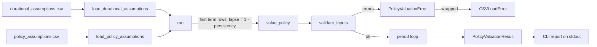

# Term policy death-benefit valuation calculator

## 1. Problem statement

Vita has a working calculator (`python/policy_valuation.py` and `python/run_from_csv.py`) that computes the expected present value of a term policy's death benefit, but it was written without a spec. There is no authoritative statement of what it must compute, what inputs it accepts, what it rejects, or what its outputs are, so it cannot be rebuilt, reviewed, or tested against a fixed definition.

## 2. Background

The pricing engine will eventually combine the outputs of the mortality, persistency, and propensity-to-buy modules into a price and an ROI result. This calculator is the first piece of that combination. It takes three streams that the other modules will eventually supply (a mortality rate per duration, a persistency rate per duration, and a propensity-to-buy probability) plus an interest rate per duration and a face amount, and returns one number per policy along with a period-by-period schedule.

The calculation has already been verified independently. The workbook `python/policy_valuation_uat.xlsx` reproduces the calculation with Excel formulas and matches the Python output to full double precision for the two sample policies. The golden values in Section 8 come from that verified run.

Several methodology choices in this calculator are deliberate simplifications and are not yet approved actuarial decisions. They are stated precisely in Section 6 so that the result is reproducible, and they are listed again in Section 9 because `docs/vita-actuarial-requirements_1.md` has not yet answered the questions they depend on (Questions 4, 5, 7, and 9 of that document). An implementing agent must implement exactly what Section 6 states and must not substitute a different method it considers more correct.

The output is not a premium, a reserve, or a profit figure. Those require expense loadings, margins, and an ROI definition that do not exist yet.

## 3. Intended users

The primary users are:

- The Actuary persona and the human actuary reviewer, who use the calculator and its schedule to check that the valuation logic is sound.
- Developers and coding agents working in `modules/pricing-engine/`, who call `value_policy()` directly from Python.
- A person running the command-line tool against two CSV files to value a small batch of policies, for example when preparing or checking the Excel verification workbook.

This version has no external or customer-facing users.

## 4. Out of scope

This spec does not cover:

- Premium calculation (net or gross), expense loadings, profit margins, or risk margins.
- Reserves of any kind.
- ROI, IRR, PVFP, or any other profitability metric.
- Selecting or looking up mortality rates from a table (for example the 2015 VBT files in `data/mortality_vbt/`) by age, sex, smoker status, or underwriting class. The calculator receives qx values already chosen for each duration.
- Estimating persistency or propensity. The calculator receives these as inputs.
- Any timing assumption other than end-of-period payment of death benefits (no mid-year or continuous timing).
- Any treatment of decrements other than independent single-decrement rates.
- Applying propensity anywhere other than as a single multiplier on the total.
- Premium income, cash values, or any benefit other than the death benefit.
- HTTP APIs, Lambda handlers, Step Functions, MCP tools, or any AWS deployment.
- Writing results to a file, database, or pricing-run log. Output is to standard output only.
- Deleting or moving the existing `python/` folder. See open question Q10.

## 5. Requirements

### 5.1 Core valuation function

R1. The module provides a function `value_policy(qx, lapse, propensity_to_buy, term, interest_rate=0.0, benefit_amount=1.0)` that returns a `PolicyValuationResult` (Section 6, Data).

R2. `value_policy` validates all inputs before calculating. It checks every rule in Section 6 (Validation rules for value_policy), collects every violation it finds, and if there is at least one violation raises a single `PolicyValuationError` whose message lists all of them. It does not stop at the first violation.

R3. `interest_rate` may be a single number, which is applied to every period, or a sequence of numbers with exactly `term` elements, one per period.

R4. The calculation follows the algorithm in Section 6 (Calculation) exactly, including the order of floating-point operations, so that results match the golden values in Section 8 to within the stated tolerance.

R5. The result contains the headline value (after propensity), the value before propensity, and a schedule with one entry per period from 1 to `term`, in period order.

R6. `value_policy` has no side effects. It does not print, log, read files, or modify its input sequences.

### 5.2 CSV loading and batch run

R7. The module provides `load_durational_assumptions(path)` which reads the durational CSV (Section 6, Data), validates it, and returns a list of `DurationRow` sorted by duration.

R8. The module provides `load_policy_assumptions(path)` which reads the policy CSV, validates it, and returns a list of `PolicyRow` in file order.

R9. Both loaders collect every row-level violation in the file and raise a single `CSVLoadError` listing all of them. A missing required column is the one exception: it raises immediately, because no row can be read without it.

R10. The module provides `run(durational_path, policy_path)` which loads both files, values each policy in file order using the first `term` rows of the durational table, and returns a list of `(PolicyRow, PolicyValuationResult)` pairs in file order.

R11. If a policy's term is larger than the number of rows in the durational table, or if `value_policy` rejects a policy's inputs, `run` raises `CSVLoadError` for that policy and does not value any further policies.

### 5.3 Command-line interface

R12. Running `python -m pricing_engine.run_from_csv [DURATIONAL_CSV] [POLICY_CSV]` values every policy and prints the report described in Section 6 (CLI output format) to standard output. If a path is omitted, the defaults are `durational_assumptions.csv` and `policy_assumptions.csv` in the current working directory.

R13. (Change from current code, see D4.) If any `CSVLoadError` or `PolicyValuationError` is raised, the CLI prints the error message to standard error, prints nothing to standard output, and exits with status code 1. On success it exits with status code 0.

### 5.4 Changes from the current implementation

The current code is the reference for everything in this spec except the four items below, which are deliberate changes. Each one needs human confirmation before this spec moves to `approved` (see Q9).

- D1. Non-finite numbers are rejected. Any input number that is NaN, positive infinity, or negative infinity is a validation error. The current code accepts NaN and infinity for `interest_rate` and `benefit_amount`, and the CSV loader accepts the strings `nan` and `inf`.
- D2. If `qx` or `lapse` is not a sequence, `value_policy` raises `PolicyValuationError`. The current code raises an unhandled `TypeError` from `len()`.
- D3. CSV files are read as UTF-8, and a leading UTF-8 byte-order mark is ignored (Python encoding `utf-8-sig`). The current code uses the platform default encoding, which on Windows fails to find the first column name in a CSV saved by Excel as "CSV UTF-8".
- D4. The CLI reports errors as described in R13. The current code exits with an unhandled Python traceback.

### 5.5 Repository placement, tests, and packaging

R14. Code, contracts, tests, Dockerfile, and README live under `modules/pricing-engine/` using the layout in Section 6 (File layout), as required by `AGENTS.md`.

R15. The JSON Schema contract files listed in Section 6 (API contract) are created as part of this work.

R16. Every scenario in Section 8 is implemented as an automated pytest test. Golden-value scenarios are placed in the regression test file. All tests pass.

R17. Line coverage of `policy_valuation.py` and `run_from_csv.py` under the test suite is at least 90 percent, per `docs/architecture-and-dev-rules.md` Section 9.

R18. The implementation uses only the Python standard library at runtime. Test-only dependencies are listed in `requirements-dev.txt` with exact pinned versions.

## 6. Technical design

### File layout

All paths are relative to the repository root. Every file below is new.

```
modules/pricing-engine/
├── README.md
├── Dockerfile
├── pyproject.toml
├── requirements-dev.txt
├── contracts/
│   ├── policy-valuation.input.schema.json
│   ├── policy-valuation.output.schema.json
│   ├── durational-assumptions.csv.schema.json
│   └── policy-assumptions.csv.schema.json
├── src/
│   └── pricing_engine/
│       ├── __init__.py
│       ├── policy_valuation.py
│       └── run_from_csv.py
└── tests/
    ├── fixtures/
    │   ├── durational_assumptions.csv
    │   └── policy_assumptions.csv
    ├── test_policy_valuation.py
    ├── test_run_from_csv.py
    ├── test_cli.py
    └── test_regression_golden.py
```

`tests/fixtures/durational_assumptions.csv` and `tests/fixtures/policy_assumptions.csv` contain exactly the sample data shown in Section 8 (Sample data). Tests that need other CSV content write it to a pytest `tmp_path`.

### Data

#### Exceptions

```yaml
PolicyValuationError:
  base: ValueError
  module: pricing_engine.policy_valuation
  message_format: "Invalid policy valuation inputs:\n- <error 1>\n- <error 2> ..."
CSVLoadError:
  base: ValueError
  module: pricing_engine.run_from_csv
```

`run_from_csv.py` imports `PolicyValuationError` and `value_policy` from `policy_valuation.py`. `policy_valuation.py` does not import from `run_from_csv.py`.

#### Data classes

All four are standard-library `@dataclass` classes.

```yaml
PeriodDetail:               # policy_valuation.py; one per period
  period: int                   # 1..term
  in_force_prob: float          # probability in force at START of this period
  qx: float                     # this period's mortality rate, as given
  lapse: float                  # this period's lapse rate, as given
  interest_rate: float          # this period's own one-period rate
  expected_death_benefit: float # undiscounted, before propensity
  discount_factor: float        # cumulative, periods 1..t
  present_value: float          # discounted, before propensity

PolicyValuationResult:      # policy_valuation.py
  value: float                  # headline number, after propensity
  value_before_propensity: float
  schedule: list[PeriodDetail]  # default_factory=list; length == term

DurationRow:                # run_from_csv.py
  duration: int
  qx: float
  persistency_rate: float
  interest_rate: float

PolicyRow:                  # run_from_csv.py
  policy_id: str
  term: int
  propensity_to_buy: float
  face_amount: float
```

#### Definitions used by the validation rules

- A **number** is a value for which `isinstance(x, numbers.Real)` is true and `isinstance(x, bool)` is false. This accepts `int`, `float`, and NumPy numeric scalars, and rejects `True` and `False`.
- A **finite number** is a number for which `math.isfinite(x)` is true (D1).
- A **sequence** is a `list` or `tuple`, or any object that has both `__len__` and `__getitem__` and is not a `str` or `bytes`. This accepts NumPy arrays.

#### Validation rules for value_policy

Rules are checked in the order listed, and messages are appended in that order. `{x!r}` means Python `repr`. Within a per-element rule, elements are checked in index order.

```yaml
- id: V1
  check: term is an int, not a bool, and term > 0
  message: "term must be a positive integer, got {term!r}"
  note: if V1 fails, V4 (length checks) and V11-V13 (sequence rate checks) are skipped
- id: V2
  check: qx is a sequence                                        # D2
  message: "qx must be a sequence of numbers, got {qx!r}"
  note: if V2 fails, all other qx checks and V8 are skipped
- id: V3
  check: lapse is a sequence                                     # D2
  message: "lapse must be a sequence of numbers, got {lapse!r}"
  note: if V3 fails, all other lapse checks and V8 are skipped
- id: V4
  check: len(qx) == term, then len(lapse) == term
  messages:
    - "qx has length {len(qx)}, expected {term} (one value per period)"
    - "lapse has length {len(lapse)}, expected {term} (one value per period)"
- id: V5
  check: each qx[i] is a finite number in [0, 1]
  messages:
    not_number: "qx[{i}] is not a number: {q!r}"
    not_finite: "qx[{i}] = {q} is not finite"                   # D1
    out_of_range: "qx[{i}] = {q} is outside [0, 1]"
- id: V6
  check: each lapse[i] is a finite number in [0, 1]
  messages:
    not_number: "lapse[{i}] is not a number: {l!r}"
    not_finite: "lapse[{i}] = {l} is not finite"                # D1
    out_of_range: "lapse[{i}] = {l} is outside [0, 1]"
- id: V7
  note: reserved, not used
- id: V8
  check: only when len(qx) == len(lapse); for each i where both qx[i] and lapse[i] are finite numbers, qx[i] + lapse[i] <= 1
  message: "qx[{i}] + lapse[{i}] = {q + l} > 1 — death and lapse probabilities for the same period shouldn't sum past 1"
- id: V9
  check: propensity_to_buy is a finite number in [0, 1]
  messages:
    not_number: "propensity_to_buy is not a number: {p!r}"
    not_finite: "propensity_to_buy = {p} is not finite"         # D1
    out_of_range: "propensity_to_buy = {p} is outside [0, 1]"
- id: V10
  check: scalar interest_rate is finite and > -1
  applies_when: interest_rate is a number (checked whether or not V1 passed)
  messages:
    not_finite: "interest_rate = {r} is not finite"              # D1
    too_low: "interest_rate = {r} must be > -1 (otherwise the discount factor is undefined or non-positive)"
- id: V11
  check: sequence interest_rate has length == term
  applies_when: V1 passed and interest_rate is a sequence
  message: "interest_rate has length {n}, expected {term} (one rate per period) when given as a sequence"
  note: if V11 fails, V12 is skipped
- id: V12
  check: each interest_rate[i] is a finite number > -1
  applies_when: V1 passed, interest_rate is a sequence, V11 passed
  messages:
    not_number: "interest_rate[{i}] is not a number: {r!r}"
    not_finite: "interest_rate[{i}] = {r} is not finite"        # D1
    too_low: "interest_rate[{i}] = {r} must be > -1 (otherwise the discount factor is undefined or non-positive)"
- id: V13
  check: interest_rate is a number or a sequence
  applies_when: V1 passed
  message: "interest_rate must be a number or a sequence of numbers, got {interest_rate!r}"
- id: V14
  check: benefit_amount is a finite number > 0
  messages:
    not_number: "benefit_amount is not a number: {b!r}"
    not_finite: "benefit_amount = {b} is not finite"            # D1
    too_low: "benefit_amount = {b} must be positive"
```

Boundary values are valid: qx of exactly 0 or 1, lapse of exactly 0 or 1, qx + lapse exactly 1, propensity of exactly 0 or 1, and any interest rate strictly greater than -1 (including negative rates such as -0.01).

For each element, report at most one message: the first applicable one from not_number, not_finite, out_of_range/too_low.

#### Durational assumptions CSV

One row per duration. Shared by every policy in a run.

```yaml
file: durational_assumptions.csv
encoding: utf-8-sig                          # D3
header_row: required
required_columns: [duration, qx, persistency_rate, interest_rate]
extra_columns: ignored
column_order: any
columns:
  duration:         {parse: int(),   rule: "unique; after sorting, exactly 1..N with no gaps"}
  qx:               {parse: float(), rule: "range checked later by value_policy (V5)"}
  persistency_rate: {parse: float(), rule: "finite, in [0, 1], checked by the loader"}
  interest_rate:    {parse: float(), rule: "range checked later by value_policy (V12)"}
conversion: "lapse = 1.0 - persistency_rate, computed in run(), not stored"
```

Loader behavior, in order:

1. Open with `newline=""` and encoding `utf-8-sig`, and read with `csv.DictReader`.
2. If any required column is missing from the header, raise immediately: `CSVLoadError(f"{path}: missing required column(s): {sorted(missing)}")`.
3. For each data row, the row label is `f"{path}, row {i}"` where `i` is the 1-based line number in the file with the header as row 1, so the first data row is row 2.
4. Parse `duration` with `int()`. On failure, append `f"{row_label}: duration = {raw!r} is not an integer"` and skip the rest of this row. The string `"3.0"` is not a valid integer.
5. If the duration was already seen, append `f"{row_label}: duplicate duration {duration}"`. Continue processing the row.
6. Parse `qx`, `persistency_rate`, and `interest_rate` with `float()`. For each that fails, append `f"{row_label}: {field} = {raw!r} is not a number"`. For each that parses to a non-finite value, append `f"{row_label}: {field} = {raw!r} is not finite"` (D1) and treat it as a failed parse.
7. If `persistency_rate` parsed, and it is outside [0, 1], append `f"{row_label}: persistency_rate = {value} is outside [0, 1]"`. The row is still kept.
8. If all three floats parsed, append a `DurationRow` to the result.
9. After all rows, sort the result by duration. If the list of durations is not exactly `[1, 2, ..., len(rows)]`, append `f"{path}: durations must be contiguous starting at 1 with no gaps — found {actual}, expected {expected}"`.
10. If any messages were collected, raise `CSVLoadError("Invalid durational assumptions file:\n- " + "\n- ".join(messages))`.

A file with a header and no data rows is valid and returns an empty list.

#### Policy assumptions CSV

One row per policy to value.

```yaml
file: policy_assumptions.csv
encoding: utf-8-sig                          # D3
header_row: required
required_columns: [policy_id, term, propensity_to_buy, face_amount]
extra_columns: ignored
column_order: any
columns:
  policy_id:         {parse: str as-is, rule: "non-empty; unique within file"}
  term:              {parse: int(),     rule: "> 0; must be <= number of durational rows (checked in run())"}
  propensity_to_buy: {parse: float(),   rule: "range checked later by value_policy (V9)"}
  face_amount:       {parse: float(),   rule: "passed as benefit_amount; range checked later by value_policy (V14)"}
```

Loader behavior, in order:

1. Open and check required columns exactly as for the durational file.
2. The row label is `f"{path}, row {i} (policy_id={policy_id!r})"`.
3. If `policy_id` is empty, append `f"{row_label}: policy_id is empty"`. Otherwise, if it was already seen, append `f"{row_label}: duplicate policy_id {policy_id!r}"`.
4. Parse `term` with `int()`. If parsing fails or the result is not greater than 0, append `f"{row_label}: term = {raw!r} is not a positive integer"`.
5. Parse `propensity_to_buy` and `face_amount` with `float()`, using the same failure and non-finite messages as the durational loader.
6. If term, propensity, and face amount all parsed, append a `PolicyRow`. A row with an empty or duplicate policy_id is still appended, but the error causes the load to fail at step 7.
7. If any messages were collected, raise `CSVLoadError("Invalid policy assumptions file:\n- " + "\n- ".join(messages))`.

A file with a header and no data rows is valid and returns an empty list.

#### run()

```
run(durational_path, policy_path) -> list[tuple[PolicyRow, PolicyValuationResult]]
```

1. Load the durational file, then the policy file. Errors from either propagate.
2. Let `N` be the number of durational rows. For each policy in file order:
   1. If `policy.term > N`, raise `CSVLoadError(f"Policy {policy.policy_id!r} has term={policy.term}, but {durational_path} only has {N} duration(s) of assumptions")`.
   2. Take the first `policy.term` durational rows. Build `qx` from their `qx`, `lapse` as `1.0 - persistency_rate` for each, and `interest_rate` as a list from their `interest_rate`.
   3. Call `value_policy(qx=qx, lapse=lapse, propensity_to_buy=policy.propensity_to_buy, term=policy.term, interest_rate=interest_rate, benefit_amount=policy.face_amount)`.
   4. If it raises `PolicyValuationError e`, raise `CSVLoadError(f"Policy {policy.policy_id!r} failed valuation: {e}")`.
3. Return the list of pairs.

### Calculation

Notation: for period `t` from 1 to `term`, `q_t = qx[t-1]`, `l_t = lapse[t-1]`, `r_t` is the period's interest rate (the scalar, or `interest_rate[t-1]`), and `B = benefit_amount`, `P = propensity_to_buy`.

Methodology, stated as fixed choices for this version:

1. Death and lapse are independent within a period. The probability of remaining in force through period `t` is `(1 - q_t) * (1 - l_t)`.
2. A death during period `t` pays `B` at the end of period `t`.
3. The discount factor for period `t` is the product of `1 / (1 + r_k)` for `k = 1..t`. A flat rate is the case where every `r_k` is equal.
4. Propensity is applied once, as a multiplier on the total present value.

Formulas:

```
in_force_1 = 1
in_force_t = in_force_{t-1} * (1 - q_{t-1}) * (1 - l_{t-1})        for t >= 2
DF_t       = DF_{t-1} * (1 / (1 + r_t)),  DF_0 = 1
EDB_t      = in_force_t * q_t * B
PV_t       = EDB_t * DF_t
APV        = sum of PV_t for t = 1..term
value      = APV * P
```

Implementation, which must be followed exactly so that floating-point results match the golden values:

```python
rates = [interest_rate] * term if scalar else list(interest_rate)
in_force = 1.0
cum_discount = 1.0
total_pv = 0.0
schedule = []
for t in range(1, term + 1):
    q = qx[t - 1]; l = lapse[t - 1]; r = rates[t - 1]
    cum_discount *= 1.0 / (1.0 + r)
    expected_death_benefit = in_force * q * benefit_amount
    pv = expected_death_benefit * cum_discount
    total_pv += pv
    schedule.append(PeriodDetail(period=t, in_force_prob=in_force, qx=q, lapse=l,
                                 interest_rate=r,
                                 expected_death_benefit=expected_death_benefit,
                                 discount_factor=cum_discount, present_value=pv))
    in_force *= (1.0 - q) * (1.0 - l)
value = total_pv * propensity_to_buy
return PolicyValuationResult(value=value, value_before_propensity=total_pv, schedule=schedule)
```

No rounding is applied anywhere in the calculation. Rounding happens only in the CLI display.

### CLI output format

Module entry point: `src/pricing_engine/run_from_csv.py` with an `if __name__ == "__main__":` block, runnable as `python -m pricing_engine.run_from_csv`.

On success, print exactly these lines to standard output:

```python
print(f"{'policy_id':<10} {'term':>4} {'propensity':>10} {'face_amount':>12} {'value':>14}")
print("-" * 56)
for policy, result in results:
    print(f"{policy.policy_id:<10} {policy.term:>4} {policy.propensity_to_buy:>10.2f} "
          f"{policy.face_amount:>12,.0f} {result.value:>14,.2f}")
```

With the sample data, the output is:

```
policy_id  term propensity  face_amount          value
--------------------------------------------------------
POL-001       3       0.50      100,000       2,463.82
POL-002       5       0.35      250,000       8,380.76
```

If the policy file has no data rows, only the two header lines are printed.

### API contract

No contract exists yet. The four JSON Schema files listed in File layout must be written (JSON Schema draft 2020-12) as part of this work. Once written, they are authoritative over this section. Their required content:

- `policy-valuation.input.schema.json`: an object with properties `qx` (array of numbers, each 0 to 1), `lapse` (array of numbers, each 0 to 1), `propensity_to_buy` (number, 0 to 1), `term` (integer, minimum 1), `interest_rate` (either a number with exclusiveMinimum -1, or an array of such numbers; default 0), and `benefit_amount` (number, exclusiveMinimum 0; default 1). Required: `qx`, `lapse`, `propensity_to_buy`, `term`. The cross-field rules (array lengths equal `term`, `qx[i] + lapse[i] <= 1`) cannot be expressed in JSON Schema and must be stated in the schema's `description` with a reference to this spec.
- `policy-valuation.output.schema.json`: an object with `value` (number), `value_before_propensity` (number), and `schedule` (array of objects with the eight `PeriodDetail` fields, all required, `period` an integer with minimum 1, the rest numbers).
- `durational-assumptions.csv.schema.json` and `policy-assumptions.csv.schema.json`: each describes one CSV row as an object whose property names are the required column names, with the types and ranges from the CSV tables above, and a `description` stating the file-level rules (header required, contiguous durations, unique policy_id).

Contract tests validate: the sample inputs for POL-001 and POL-002 against the input schema, and the result of `dataclasses.asdict()` on each golden result against the output schema. `jsonschema` is a test-only dependency.

### Tools and libraries

```yaml
runtime:
  python: "3.12"
  dependencies: none (standard library only: csv, dataclasses, math, numbers, sys, typing)
test_only:                     # pin exact versions in requirements-dev.txt
  pytest: "8.x"
  pytest-cov: "latest compatible with the pinned pytest"
  jsonschema: "4.x"
container:
  base_image: "python:3.12-slim"
  entrypoint: ["python", "-m", "pricing_engine.run_from_csv"]
packaging:
  pyproject.toml: src layout, package name pricing_engine, requires-python ">=3.12"
```

The Dockerfile copies `src/` and installs the package, runs as a non-root user, and uses `/data` as the working directory so that a user can mount a folder containing the two CSV files there and run the container with no arguments.

`README.md` states the module's purpose, its inputs and outputs, the owning persona (actuary), how to run the CLI and the tests, and a link to this spec.

## 7. Visual aids



## 8. Acceptance criteria

### Sample data

`tests/fixtures/durational_assumptions.csv`:

```
duration,qx,persistency_rate,interest_rate
1,0.01,0.95,0.05
2,0.02,0.95,0.05
3,0.03,0.95,0.05
4,0.035,0.94,0.045
5,0.04,0.94,0.045
```

`tests/fixtures/policy_assumptions.csv`:

```
policy_id,term,propensity_to_buy,face_amount
POL-001,3,0.5,100000
POL-002,5,0.35,250000
```

### Numeric tolerance

Unless a scenario says "exactly", a number matches when `pytest.approx(expected, rel=1e-12, abs=1e-12)` holds.

### Golden values

These were produced by the current code and independently reproduced by `python/policy_valuation_uat.xlsx`.

```yaml
POL-001:
  value_before_propensity: 4927.6462585034005
  value: 2463.8231292517003
  schedule:
    - {period: 1, in_force_prob: 1.0,                expected_death_benefit: 1000.0,             discount_factor: 0.9523809523809523, present_value: 952.3809523809523}
    - {period: 2, in_force_prob: 0.9405,             expected_death_benefit: 1881.0,             discount_factor: 0.9070294784580498, present_value: 1706.1224489795918}
    - {period: 3, in_force_prob: 0.8756054999999999, expected_death_benefit: 2626.8164999999995, discount_factor: 0.863837598531476,  present_value: 2269.1428571428564}
POL-002:
  value_before_propensity: 23945.01495361781
  value: 8380.755233766233
  schedule:
    - {period: 1, in_force_prob: 1.0,                expected_death_benefit: 2500.0,             discount_factor: 0.9523809523809523, present_value: 2380.9523809523807}
    - {period: 2, in_force_prob: 0.9405,             expected_death_benefit: 4702.5,             discount_factor: 0.9070294784580498, present_value: 4265.306122448979}
    - {period: 3, in_force_prob: 0.8756054999999999, expected_death_benefit: 6567.041249999999,  discount_factor: 0.863837598531476,  present_value: 5672.857142857142}
    - {period: 4, in_force_prob: 0.80687046825,      expected_death_benefit: 7060.116597187501,  discount_factor: 0.8266388502693551, present_value: 5836.166666666668}
    - {period: 5, in_force_prob: 0.7319122017495749, expected_death_benefit: 7319.12201749575,   discount_factor: 0.7910419619802442, present_value: 5789.732640692641}
```

### Scenarios: calculation

```gherkin
Feature: value_policy calculation

  Scenario: Golden values for the sample policies
    Given the sample durational and policy CSV files
    When run() is called on them
    Then two results are returned in the order POL-001, POL-002
    And each result's value, value_before_propensity, and every schedule field match the golden values

  Scenario: Single period, no discounting
    Given qx [0.1], lapse [0.0], propensity 1.0, term 1, interest_rate 0.0, benefit_amount 1000.0
    When value_policy is called
    Then value is 100.0 and value_before_propensity is 100.0

  Scenario: Lapse reduces the in-force probability for the next period
    Given qx [0.1, 0.1], lapse [0.5, 0.0], propensity 1.0, term 2, interest_rate 0.0, benefit_amount 1.0
    When value_policy is called
    Then schedule[1].in_force_prob is 0.45
    And value_before_propensity is 0.145

  Scenario: Death benefit is discounted for the full period
    Given qx [0.5], lapse [0.0], propensity 1.0, term 1, interest_rate 0.1, benefit_amount 110.0
    When value_policy is called
    Then schedule[0].discount_factor is 1/1.1
    And value is 50.0

  Scenario: Duration-varying interest rates compound period by period
    Given qx [0.1, 0.2], lapse [0.0, 0.0], propensity 0.5, term 2, interest_rate [0.0, 0.25], benefit_amount 1000.0
    When value_policy is called
    Then schedule[0].present_value is 100.0
    And schedule[1].discount_factor is 0.8
    And schedule[1].present_value is 144.0
    And value_before_propensity is 244.0
    And value is 122.0

  Scenario: A scalar interest rate gives the same result as the same rate repeated
    Given the POL-002 inputs with interest_rate 0.05 as a scalar
    And the POL-002 inputs with interest_rate [0.05, 0.05, 0.05, 0.05, 0.05]
    When value_policy is called on each
    Then both results are exactly equal, including every schedule field

  Scenario: Default arguments mean no discounting and a unit benefit
    Given qx [0.1, 0.2], lapse [0.0, 0.0], propensity 1.0, term 2, and no interest_rate or benefit_amount
    When value_policy is called
    Then every schedule discount_factor is exactly 1.0
    And value_before_propensity is 0.1 + 0.9 * 0.2

  Scenario: Zero propensity
    Given the POL-001 inputs with propensity 0.0
    When value_policy is called
    Then value is exactly 0.0
    And value_before_propensity matches the POL-001 golden value

  Scenario: Zero mortality
    Given qx all 0.0 for 5 periods and any valid other inputs
    When value_policy is called
    Then value and value_before_propensity are exactly 0.0

  Scenario: Certain death in period 1
    Given qx [1.0, 0.5], lapse [0.0, 0.0], propensity 1.0, term 2, interest_rate 0.0, benefit_amount 1.0
    When value_policy is called
    Then schedule[1].in_force_prob is exactly 0.0
    And value_before_propensity is exactly 1.0

  Scenario: Negative interest rate above -1 is accepted
    Given qx [0.1], lapse [0.0], propensity 1.0, term 1, interest_rate -0.01, benefit_amount 1.0
    When value_policy is called
    Then no error is raised
    And schedule[0].discount_factor is 1/0.99

  Scenario: Schedule echoes inputs
    Given the POL-002 inputs
    When value_policy is called
    Then the schedule has 5 entries with period 1 to 5 in order
    And each entry's qx, lapse, and interest_rate equal the inputs for that period exactly

  Scenario: Inputs are not modified
    Given qx, lapse, and interest_rate lists
    When value_policy is called
    Then each list is equal to a copy taken before the call
```

### Scenarios: validation of value_policy

For each scenario below, start from valid inputs (qx [0.1, 0.2], lapse [0.05, 0.05], propensity 0.5, term 2, interest_rate 0.05, benefit_amount 1000.0) and change only what the scenario states. "Raises with message M" means a `PolicyValuationError` is raised and M appears as one of the `- ` lines in its message.

```gherkin
Feature: value_policy validation

  Scenario Outline: A single invalid input is rejected with a specific message
    Given valid inputs
    When <field> is set to <value> and value_policy is called
    Then it raises with message <message>

    Examples:
      | field             | value            | message                                                                 |
      | term              | 0                | term must be a positive integer, got 0                                  |
      | term              | True             | term must be a positive integer, got True                               |
      | term              | 2.0              | term must be a positive integer, got 2.0                                |
      | qx                | [0.1]            | qx has length 1, expected 2 (one value per period)                      |
      | qx                | None             | qx must be a sequence of numbers, got None                              |
      | qx                | [0.1, 1.5]       | qx[1] = 1.5 is outside [0, 1]                                           |
      | qx                | [0.1, "a"]       | qx[1] is not a number: 'a'                                              |
      | qx                | [0.1, nan]       | qx[1] = nan is not finite                                               |
      | lapse             | [0.05, -0.1]     | lapse[1] = -0.1 is outside [0, 1]                                       |
      | lapse             | [0.05, 0.9]      | qx[1] + lapse[1] = 1.1 > 1 — death and lapse probabilities for the same period shouldn't sum past 1 |
      | propensity_to_buy | 1.2              | propensity_to_buy = 1.2 is outside [0, 1]                               |
      | interest_rate     | -1.0             | interest_rate = -1.0 must be > -1 (otherwise the discount factor is undefined or non-positive) |
      | interest_rate     | [0.05]           | interest_rate has length 1, expected 2 (one rate per period) when given as a sequence |
      | interest_rate     | [0.05, -2.0]     | interest_rate[1] = -2.0 must be > -1 (otherwise the discount factor is undefined or non-positive) |
      | interest_rate     | inf              | interest_rate = inf is not finite                                       |
      | interest_rate     | "0.05"           | interest_rate must be a number or a sequence of numbers, got '0.05'     |
      | benefit_amount    | 0                | benefit_amount = 0 must be positive                                     |
      | benefit_amount    | nan              | benefit_amount = nan is not finite                                      |

  Scenario: All violations are reported together
    Given valid inputs
    When term is 0, propensity_to_buy is 1.2, and benefit_amount is -5
    Then one PolicyValuationError is raised
    And its message starts with "Invalid policy valuation inputs:"
    And it contains the term, propensity_to_buy, and benefit_amount messages in that order

  Scenario: Boundary values are accepted
    Given qx [0.0, 1.0], lapse [1.0, 0.0], propensity 1.0, term 2, interest_rate 0.0, benefit_amount 1.0
    When value_policy is called
    Then no error is raised

  Scenario: PolicyValuationError is a ValueError
    Given any invalid input
    When value_policy is called
    Then the raised exception is an instance of ValueError
```

The qx + lapse message in the table uses Python's float `repr` of the sum, which is `1.1` for 0.2 + 0.9 on CPython 3.12. The test asserts the exact string produced by `f"{q + l}"`, not a hand-typed value.

### Scenarios: CSV loading and run()

```gherkin
Feature: CSV loading and batch valuation

  Scenario: Missing required column
    Given a durational CSV whose header lacks interest_rate
    When load_durational_assumptions is called
    Then CSVLoadError is raised with message "<path>: missing required column(s): ['interest_rate']"

  Scenario: Extra columns and a different column order are accepted
    Given a durational CSV with columns interest_rate,note,qx,duration,persistency_rate and the sample values
    When run() is called with the sample policy CSV
    Then the results match the golden values

  Scenario: Rows out of order are sorted
    Given the sample durational CSV with its rows in reverse order
    When run() is called with the sample policy CSV
    Then the results match the golden values

  Scenario: Duplicate duration
    Given a durational CSV where row 3 repeats duration 1
    When load_durational_assumptions is called
    Then CSVLoadError is raised and its message contains "row 3: duplicate duration 1"

  Scenario: Gap in durations
    Given a durational CSV with durations 1, 2, 4
    When load_durational_assumptions is called
    Then CSVLoadError is raised and its message contains "durations must be contiguous starting at 1 with no gaps — found [1, 2, 4], expected [1, 2, 3]"

  Scenario: Non-integer duration
    Given a durational CSV where row 2 has duration "1.0"
    When load_durational_assumptions is called
    Then CSVLoadError is raised and its message contains "row 2: duration = '1.0' is not an integer"

  Scenario: Persistency out of range
    Given a durational CSV where row 2 has persistency_rate 1.2
    When load_durational_assumptions is called
    Then CSVLoadError is raised and its message contains "row 2: persistency_rate = 1.2 is outside [0, 1]"

  Scenario: Non-numeric and non-finite values
    Given a durational CSV where row 2 has qx "abc" and row 3 has interest_rate "nan"
    When load_durational_assumptions is called
    Then one CSVLoadError is raised
    And its message contains "row 2: qx = 'abc' is not a number"
    And its message contains "row 3: interest_rate = 'nan' is not finite"

  Scenario: File saved by Excel with a byte-order mark
    Given the sample durational CSV saved with a leading UTF-8 byte-order mark
    When load_durational_assumptions is called
    Then 5 rows are returned and no error is raised

  Scenario: Duplicate and empty policy IDs
    Given a policy CSV where row 3 repeats POL-001 and row 4 has an empty policy_id
    When load_policy_assumptions is called
    Then one CSVLoadError is raised
    And its message contains "duplicate policy_id 'POL-001'"
    And its message contains "policy_id is empty"

  Scenario: Invalid term in the policy file
    Given a policy CSV where POL-001 has term "3.5"
    When load_policy_assumptions is called
    Then CSVLoadError is raised and its message contains "term = '3.5' is not a positive integer"

  Scenario: Policy term longer than the durational table
    Given the sample durational CSV and a policy CSV with POL-009 term 6
    When run() is called
    Then CSVLoadError is raised with message "Policy 'POL-009' has term=6, but <durational_path> only has 5 duration(s) of assumptions"

  Scenario: A policy that fails valuation stops the run
    Given the sample durational CSV and a policy CSV with POL-001 face_amount 0 followed by POL-002
    When run() is called
    Then CSVLoadError is raised with a message starting "Policy 'POL-001' failed valuation: Invalid policy valuation inputs:"
    And no result is returned for POL-002

  Scenario: Shorter term uses the first rows only
    Given the sample durational CSV and a policy with term 3
    When run() is called
    Then the value_policy call receives only durations 1 to 3

  Scenario: Empty policy file
    Given the sample durational CSV and a policy CSV with a header and no rows
    When run() is called
    Then an empty list is returned
```

### Scenarios: command line

```gherkin
Feature: Command-line report

  Scenario: Report for the sample data
    Given a working directory containing the two sample CSV files
    When "python -m pricing_engine.run_from_csv" is run with no arguments
    Then the exit code is 0
    And standard output is exactly the four lines shown in Section 6 (CLI output format)

  Scenario: Explicit paths
    Given the sample CSV files in a different directory
    When the CLI is run with both paths as arguments
    Then the output is the same four lines

  Scenario: Invalid input
    Given a policy CSV with a duplicate policy_id
    When the CLI is run
    Then the exit code is 1
    And standard output is empty
    And standard error contains "duplicate policy_id"
    And standard error does not contain "Traceback"
```

### Test-suite requirements

- Every scenario above is an automated pytest test. Scenario Outlines use `pytest.mark.parametrize`.
- The golden-value scenario lives in `tests/test_regression_golden.py`.
- Coverage of `policy_valuation.py` and `run_from_csv.py` is at least 90 percent (`pytest --cov=pricing_engine --cov-fail-under=90`).
- The contract tests in Section 6 (API contract) pass.

## 9. Open questions

Q1. Propensity placement. Propensity is applied once, to the total. Should it instead apply inside the survivorship chain, or not affect the valuation at all and only drive volume in an ROI calculation? This depends on Question 4 of `docs/vita-actuarial-requirements_1.md`.

Q2. Benefit timing. Deaths are assumed to pay at the end of the period. Is a mid-period or continuous assumption required for pricing?

Q3. Decrement treatment. Death and lapse are treated as independent, and lapse in period t removes policyholders only from period t+1 onward. Is that the intended order, or should lapse be applied before deaths within a period?

Q4. Mortality basis. qx is a single durational vector shared by every policy in a run, with no issue age, sex, smoker status, or underwriting class. When will qx come from the mortality module or the 2015 VBT tables in `data/mortality_vbt/`, and should that be a separate spec?

Q5. Discount rate source. Where do the per-duration interest rates come from, and do pricing and ROI use the same rates? This depends on Question 7 of the actuarial requirements document.

Q6. Error handling across policies. `run()` stops at the first policy that fails. Should it instead value every policy and report all failures together?

Q7. Pricing-run log. Should each run record input file hashes, code version, and results, as described in Question 15 of the actuarial requirements document and Section 6 of the to-do list? It is out of scope here.

Q8. Module name. This spec places the calculator in `pricing-engine` because it combines outputs of the mortality, persistency, and propensity modules. It has also been called the mortality calculator. Is `pricing-engine` the right home?

Q9. Confirm the four deliberate changes from the current code: D1 (reject non-finite numbers), D2 (reject non-sequence qx and lapse with a validation error), D3 (read CSVs as UTF-8 with an optional byte-order mark), and D4 (CLI errors on stderr with exit code 1).

Q10. Existing code. After `modules/pricing-engine/` is built and passes, should `python/` be deleted, kept as a reference, or moved into the test fixtures?

Q11. Excel verification workbook. Should `python/policy_valuation_uat.xlsx` move into `modules/pricing-engine/tests/` as a maintained acceptance artifact, and should a test check its values against the Python output?

## 10. Sign-off

- [ ] Persona review(s) complete: actuary, architecture, data-engineer, product-owner
- [ ] LLM-as-judge review passed (routine changes only)
- [ ] Human sign-off obtained — **required** because `touches_core_model_logic: true`, regardless of judge score
